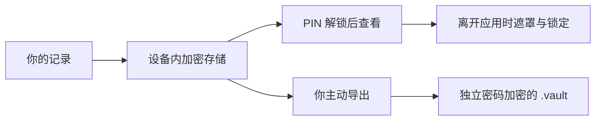

<p align="center">
  
</p>

<h1 align="center">花笺 · HanaNote</h1>
<p align="center"><strong>把变化写成故事，把隐私留给自己。</strong></p>
<p align="center">为跨性别女性打造的 HRT 健康记录空间。温柔的界面，认真对待的安全。</p>

<p align="center">
  <a href="README.md">简体中文</a> ·
  <a href="docs/README_EN.md">English</a> ·
  <a href="docs/README_JA.md">日本語</a>
</p>

<p align="center">
  
  
  
  
</p>

<p align="center">
  <a href="https://github.com/cantascendia/hananote/releases"><strong>公开发行版</strong></a> &nbsp; · &nbsp;
  <a href="#真实的花笺"><strong>看看应用</strong></a> &nbsp; · &nbsp;
  <a href="docs/releases/android-v1.2.3-verification.md"><strong>验证报告</strong></a> &nbsp; · &nbsp;
  <a href="https://github.com/cantascendia/hananote/issues"><strong>反馈问题</strong></a>
</p>

---

## 一份只属于你的日常

今天的用药、一次血检、身体的细微变化，或一句只想留给自己的话。
HanaNote 把这些记录收在一起，让你在自己的节奏里回看这段旅程。

| 记录今天 | 看见变化 | 守住边界 |
| :--- | :--- | :--- |
| 用药方案、剂量日志与本地提醒 | 血检趋势、身体测量与跨功能时间线 | 加密数据库、PIN 锁定与后台遮罩 |
| 库存管理与心情日记 | 已设置 HRT 日期后的里程碑 | 相机拍摄、加密照片与独立密码备份 |

## 真实的花笺

<table>
  <tr>
    <th align="center">今天 · 从容开始</th>
    <th align="center">记录 · 留住微小变化</th>
    <th align="center">个人 · 掌握自己的数据</th>
  </tr>
  <tr>
    <td align="center"></td>
    <td align="center"></td>
    <td align="center"></td>
  </tr>
</table>

<p align="center"><sub>上方为实际 Android 模拟器截图，仅使用合成资料；页首为 AI 生成的品牌插画。截图中的空白状态也是产品的一部分：未填写的健康信息不会被虚构。</sub></p>

## Android v1.2.3 · 更稳妥地记录

这轮维护围绕启动、隐私、提醒和备份展开。**截至 2026-09-22，本分支包含已完成本地验收的 `1.2.3+8`；GitHub 公开发行版仍为 `v1.2.2`。** [PR #6](https://github.com/cantascendia/hananote/pull/6) 跟踪合入状态，安装包公开发布后以 Releases 为准。

| 验证项目 | 本轮结果 |
| :--- | :--- |
| 自动化测试 | **399 项通过** |
| 静态分析 | **0 错误、0 警告**；293 项信息级风格提示 |
| 格式检查 | **439 个文件通过** |
| 签名构建 | ARM64 / x86_64，沿用原发布签名 |
| Android 兼容性检查 | 最低 Android 7.0 / API 24，target SDK 36；14 个原生库通过 16KB 对齐检查 |
| 模拟器验收 | 升级保留数据、备份恢复、冲突回滚、后台锁屏、冷启动与首次设置 |

实体手机、厂商省电策略和生物识别硬件仍待设备验证。对齐检查不等同于在 16KB 页大小设备上完成运行测试。完整范围、证据与 SHA-256 见 [Android 验证报告](docs/releases/android-v1.2.3-verification.md)。

### 这次修好的细节

- **打开应用更可靠**：可选通知初始化失败不会阻断主流程，设置加载失败可以重试。
- **离开时及时遮挡**：普通后台返回要求重新验证；相机、文件选择和系统分享通过受控流程返回。
- **恢复失败不留半份数据**：先校验完整备份，再在一个 SQLCipher 事务中写入；唯一键冲突会回滚。
- **备份文件选得中，也读得稳**：Android 可选择 `.vault`，流式读取设有大小上限。
- **未知就保持未知**：没有 HRT 日期时，不显示虚构天数或生成里程碑。
- **界面适应 Android 状态栏**：顶部安全区已修复，并补充布局回归测试。

## 隐私，是每一步的默认考量



| 保护环节 | 实际行为 |
| :--- | :--- |
| 结构化记录 | SQLCipher 数据库；PIN 通过 Argon2id 派生密钥 |
| 照片 | AES-256-GCM 加密保存；仅提供相机拍摄入口，拍摄临时文件读取后清理 |
| 应用锁 | 6 位 PIN；生物识别仅用于已有密钥的热会话，冷启动需要 PIN |
| 系统备份 | Android 云备份与设备迁移规则排除应用数据 |
| 提醒 | 通知使用通用文案，不展示药名或剂量；提供全局和分药品开关 |
| 网络边界 | 本次构建未启用云端健康数据同步；可选更新检查和外部参考内容需要网络 |

**备份的范围要说清楚。** `.vault` 包含药品、方案、剂量日志、库存、血检、日记和测量；不包含照片、个人资料和应用设置。备份密码独立于 PIN，应用无法找回。旧版 JSON 只在明确选择 `.json` 文件时导入，不会作为解密失败的降级路径。PDF 是用户主动导出的明文文件，导出前会提示。

## 不止是打卡

<details open>
<summary><strong>日常记录与回顾</strong></summary>

- **用药**：药品、方案、服药日志、库存与本地提醒。
- **血检与身体测量**：整理检验结果、测量历史与趋势。
- **相册与日记**：加密照片、情绪标签、文字记录。
- **时间线**：把不同类型的记录放回同一段旅程中。
- **语言**：提供简体中文、English、日本語本地化资源；部分既有界面文案仍待统一。

</details>

<details>
<summary><strong>探索工具：PK 模拟与用药参考</strong></summary>

项目包含 V2 与 Hana-PK 模拟引擎、不同给药途径的曲线探索，以及外部用药参考入口。
模拟结果是模型估计，不是个体预测的保证，也不应作为自行调整剂量的依据。HanaNote 用于记录与理解信息，不替代专业医疗评估。

</details>

## 开始使用与开发

**使用应用**：前往 [GitHub Releases](https://github.com/cantascendia/hananote/releases) 查看已公开发布的 APK、版本说明和资产。当前维护分支的验证状态见上表；iOS 尚未作为本轮交付平台。

**运行本分支**：本轮验证环境为 Flutter **3.38.4** / Dart **3.10.3**，Android SDK **36**。

```bash
git clone --branch feat/r52-hoyo-redesign https://github.com/cantascendia/hananote.git
cd hananote
flutter pub get
dart run build_runner build --delete-conflicting-outputs
flutter gen-l10n
flutter run
```

<details>
<summary><strong>检查、构建与架构</strong></summary>

```bash
flutter analyze --no-fatal-infos
flutter test --concurrency=1
dart format --output=none --set-exit-if-changed lib test

# 需要本地配置原发布签名；不要提交密钥或 key.properties。
flutter build apk --release --split-per-abi \
  --target-platform android-arm64,android-x64
```

Feature-first Clean Architecture：`Presentation → BLoC/Cubit → Domain → Data`。

| 责任 | 技术 |
| :--- | :--- |
| 界面与导航 | Flutter · go_router |
| 状态与依赖 | flutter_bloc · get_it · injectable |
| 存储与密码学 | sqflite_sqlcipher · flutter_secure_storage · pointycastle · hashlib |
| 数据与错误 | freezed · json_serializable · fpdart |
| 趋势与测试 | fl_chart · flutter_test · bloc_test · mocktail |

签名缺失会使 release 构建失败，避免生成无法覆盖升级的错误安装包。开发时可以使用正常 debug 构建。

</details>

## 一起把它变得更好

欢迎通过 [Issues](https://github.com/cantascendia/hananote/issues) 提交设备兼容性问题、交互建议和本地化改进。报告问题时请提供系统版本、应用版本和复现步骤，隐去健康记录、PIN 与备份密码。

开发约束见 [AGENTS.md](AGENTS.md)，本轮维护约定见 [SPEC](docs/ai-cto/SPEC.md)。项目为专有软件，保留所有权利。

感谢 [estrannaise.js](https://github.com/WHSAH/estrannaise.js)、[Transfem Science](https://transfemscience.org) 与 [HRT 药典](https://hrtyaku.com) 提供的研究和参考资源。引用不代表这些项目对 HanaNote 的背书。

---

<p align="center"><strong>Your body. Your story.</strong><br /><sub>愿每一次记录，都让你更靠近自己。</sub></p>
