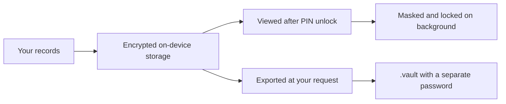

<p align="center">
  
</p>

<h1 align="center">HanaNote · 花笺</h1>
<p align="center"><strong>Your body. Your story. Your privacy.</strong></p>
<p align="center">A gentle HRT health journal for transgender women, with careful attention to security.</p>

<p align="center">
  <a href="../README.md">简体中文</a> · <a href="README_EN.md">English</a> · <a href="README_JA.md">日本語</a>
</p>

<p align="center">
  
  
  
  
</p>

<p align="center">
  <a href="https://github.com/cantascendia/hananote/releases"><strong>Public releases</strong></a> ·
  <a href="#see-hananote"><strong>See the app</strong></a> ·
  <a href="releases/android-v1.2.3-verification.md"><strong>Verification report</strong></a> ·
  <a href="https://github.com/cantascendia/hananote/issues"><strong>Report an issue</strong></a>
</p>

---

## A place for your everyday records

Keep medication schedules, a blood test, a small change in your body, or a private thought together. HanaNote helps you look back at your own pace.

| Record today | Understand change | Protect your boundaries |
| :--- | :--- | :--- |
| Medication plans, dose logs, and local reminders | Blood test trends, measurements, and a shared timeline | Encrypted database, PIN lock, and background masking |
| Inventory and mood journal | Milestones after you set an HRT start date | Camera capture, encrypted photos, and password-protected records backup |

## See HanaNote

<table>
  <tr><th align="center">Today · Begin calmly</th><th align="center">Record · Notice small changes</th><th align="center">Profile · Stay in control</th></tr>
  <tr>
    <td align="center"></td>
    <td align="center"></td>
    <td align="center"></td>
  </tr>
</table>

<p align="center"><sub>Actual Android emulator screenshots use synthetic information. The hero is an AI-generated brand illustration. Unfilled health information stays unfilled.</sub></p>

## Android v1.2.3 · More dependable records

This maintenance work focuses on startup, privacy, reminders, and backup. **As of 2026-09-22, this branch contains locally verified `1.2.3+8`; the public GitHub release is still `v1.2.2`.** [PR #6](https://github.com/cantascendia/hananote/pull/6) tracks the merge. Check Releases for a publicly available package.

| Check | Result for this branch |
| :--- | :--- |
| Automated tests | **399 passed** |
| Static analysis | **0 errors, 0 warnings**; 293 informational style notices |
| Format check | **439 files passed** |
| Signed build | ARM64 and x86_64, using the existing release signing identity |
| Android compatibility check | Minimum Android 7.0 / API 24, target SDK 36; 14 native libraries passed 16 KB alignment checks |
| Emulator acceptance | Upgrade data retention, backup restore, conflict rollback, background lock, cold start, and first setup |

A physical phone, manufacturer battery policies, and biometric hardware still need device checks. Library alignment checks do not establish runtime behavior on a 16 KB page-size device. Scope, evidence, and SHA-256 values are in the [Android verification report](releases/android-v1.2.3-verification.md).

### What changed

- Optional notification setup can fail without blocking the main flow; failed settings loads can be retried.
- Ordinary background return requires authentication again. Camera, file picker, and system share trips have bounded return handling.
- The complete backup is validated before one SQLCipher restore transaction; a unique-key conflict rolls back the transaction.
- Android can select `.vault` files even when MIME detection is missing. Streamed reads have a size limit.
- An unknown HRT start date remains unknown: no invented day count or milestone.
- The top app bar respects the Android status bar, with a layout regression test.

## Privacy by design, with explicit boundaries



| Area | Current behavior |
| :--- | :--- |
| Structured records | SQLCipher database; the PIN derives a key with Argon2id |
| Photos | Stored with AES-256-GCM; camera capture is the supported input, and temporary capture files are cleaned after reading |
| App lock | Six-digit PIN; biometrics are available only in a warm session with an existing key. A cold start requires the PIN |
| System backup | Android cloud backup and device-transfer rules exclude app data |
| Reminders | Generic notification copy omits drug names and doses; global and per-drug switches |
| Network | Health-data cloud sync is not enabled in this build. Optional update checks and external reference content require network access |

**Know what a backup contains.** A `.vault` includes drugs, schedules, dose logs, inventory, blood tests, journals, and measurements. It excludes photos, profile information, and app settings. Its password is independent of the PIN and cannot be recovered by HanaNote. Legacy JSON is imported only when you explicitly select a `.json` file; failed vault decryption never falls back to plaintext. A PDF is a plaintext file exported only at your request, with a warning first.

## Beyond a checklist

<details open><summary><strong>Daily records and reflection</strong></summary>

- Medication catalog, schedules, dose history, inventory, and local reminders.
- Blood tests, body measurements, trends, and a cross-feature timeline.
- Encrypted photos, mood tags, and private journal entries.
- Simplified Chinese, English, and Japanese localization resources; some older UI copy still needs consistency work.

</details>

<details><summary><strong>Exploration tools: PK simulation and references</strong></summary>

V2 and Hana-PK simulation engines provide curves for different administration routes, alongside external medication references. Simulations are model estimates, not reliable individual predictions or a basis for changing your dose without medical advice. HanaNote supports recording and understanding information; it does not replace professional care.

</details>

## Use and develop

For a published APK, see [GitHub Releases](https://github.com/cantascendia/hananote/releases). The maintenance branch status is above; iOS is not a delivery target for this round.

This branch was verified with Flutter **3.38.4**, Dart **3.10.3**, and Android SDK **36**.

```bash
git clone --branch feat/r52-hoyo-redesign https://github.com/cantascendia/hananote.git
cd hananote
flutter pub get
dart run build_runner build --delete-conflicting-outputs
flutter gen-l10n
flutter run
```

<details><summary><strong>Checks, build, and architecture</strong></summary>

```bash
flutter analyze --no-fatal-infos
flutter test --concurrency=1
dart format --output=none --set-exit-if-changed lib test

# Configure the existing release signing identity locally; never commit keys or key.properties.
flutter build apk --release --split-per-abi \
  --target-platform android-arm64,android-x64
```

Feature-first Clean Architecture: `Presentation → BLoC/Cubit → Domain → Data`. The project uses Flutter and go_router for UI/navigation; flutter_bloc, get_it, and injectable for state/dependencies; sqflite_sqlcipher, flutter_secure_storage, pointycastle, and hashlib for storage/cryptography; freezed, json_serializable, and fpdart for data/errors; fl_chart, flutter_test, bloc_test, and mocktail for charts/tests. Without the release signing configuration, the release build fails rather than producing an APK that cannot upgrade an installed version. Use a normal debug build for development.

</details>

## Help improve it

Please use [Issues](https://github.com/cantascendia/hananote/issues) for device compatibility reports, interaction ideas, and localization feedback. Include the OS version, app version, and reproduction steps; remove health records, PINs, and backup passwords before posting.

Development rules: [AGENTS.md](../AGENTS.md). Maintenance contract: [SPEC](ai-cto/SPEC.md). This is proprietary software; all rights reserved.

Thanks to [estrannaise.js](https://github.com/WHSAH/estrannaise.js), [Transfem Science](https://transfemscience.org), and [HRT Yakuten](https://hrtyaku.com) for research and reference material. Mention does not imply their endorsement of HanaNote.

---

<p align="center"><strong>Your body. Your story.</strong><br /><sub>Every record can bring you closer to yourself.</sub></p>
