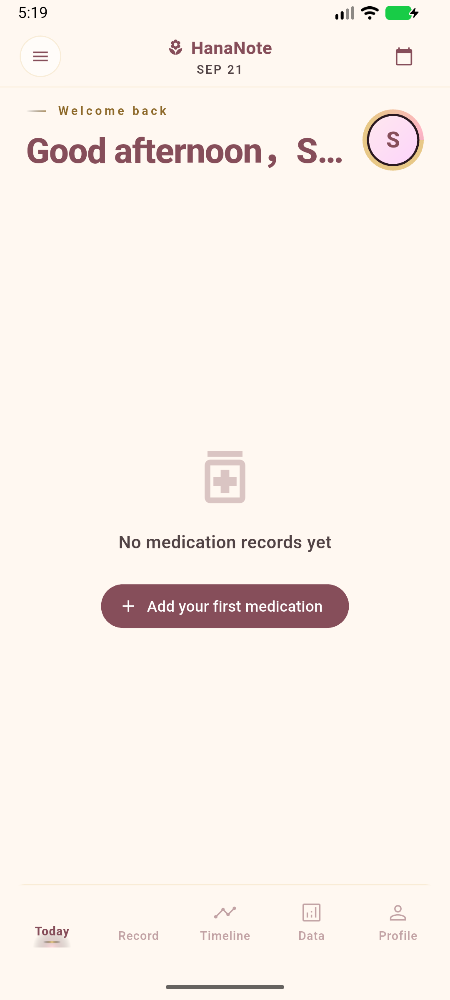
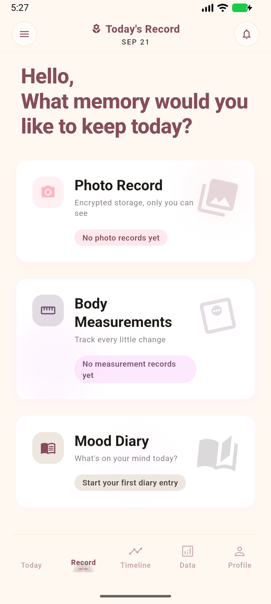
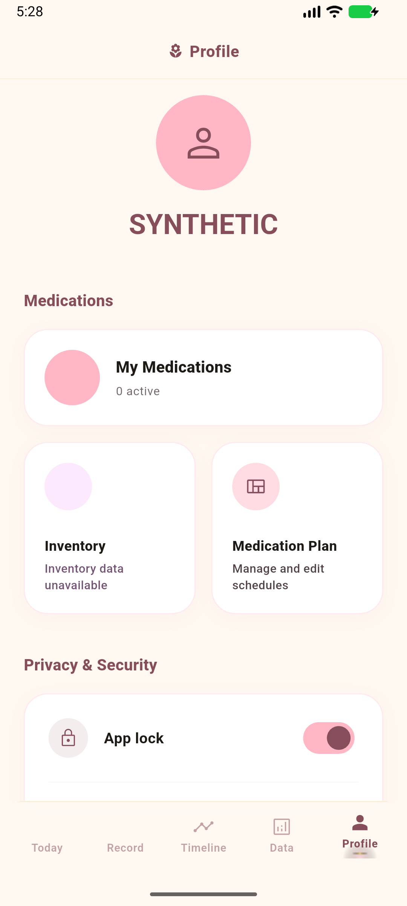
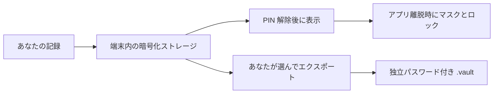

<p align="center">
  
</p>

<h1 align="center">花笺 · HanaNote</h1>
<p align="center"><strong>体の変化を物語に。プライバシーは自分の手に。</strong></p>
<p align="center">トランスジェンダー女性のための、やさしい HRT 健康記録アプリ。安全性にも真剣に向き合います。</p>

<p align="center">
  <a href="../README.md">简体中文</a> · <a href="README_EN.md">English</a> · <a href="README_JA.md">日本語</a>
</p>

<p align="center">
  
  
  
  
</p>

<p align="center">
  <a href="https://github.com/cantascendia/hananote/releases"><strong>公開リリース</strong></a> ·
  <a href="#実際の画面"><strong>画面を見る</strong></a> ·
  <a href="releases/android-v1.2.3-verification.md"><strong>検証レポート</strong></a> ·
  <a href="https://github.com/cantascendia/hananote/issues"><strong>問題を報告</strong></a>
</p>

---

## 自分だけの日々の記録

今日の服薬、血液検査、体の小さな変化、誰にも見せない一言。HanaNote はそれらをひとつにまとめ、自分のペースで振り返れるようにします。

| 今日を記録 | 変化を知る | 境界を守る |
| :--- | :--- | :--- |
| 服薬計画・投与ログ・端末内リマインダー | 血液検査の推移・身体測定・横断的なタイムライン | 暗号化データベース・PIN ロック・バックグラウンド時のマスク |
| 在庫管理・気分の日記 | HRT 開始日を設定した後のマイルストーン | カメラ撮影・暗号化写真・独立パスワードの記録バックアップ |

## 実際の画面

<table>
  <tr><th align="center">今日 · 落ち着いて始める</th><th align="center">記録 · 小さな変化を残す</th><th align="center">プロフィール · データを自分で管理する</th></tr>
  <tr>
    <td align="center"></td>
    <td align="center"></td>
    <td align="center"></td>
  </tr>
</table>

<p align="center"><sub>上の写真は架空の情報を使った Android エミュレーターの実画面です。先頭のイラストは AI 生成のブランド画像です。未入力の健康情報を補って表示することはありません。</sub></p>

## Android v1.2.3 · より安心して記録するために

今回は起動、プライバシー、通知、バックアップの安定性を改善しました。**2026-09-22 時点で、このブランチの `1.2.3+8` はローカル検証済みです。GitHub で公開中のリリースは引き続き `v1.2.2` です。** マージ状況は [PR #6](https://github.com/cantascendia/hananote/pull/6) を参照してください。公開 APK の有無は Releases で確認してください。

| 検証項目 | このブランチでの結果 |
| :--- | :--- |
| 自動テスト | **399 件成功** |
| 静的解析 | **エラー 0、警告 0**。情報レベルのスタイル通知 293 件 |
| フォーマット確認 | **439 ファイル合格** |
| 署名付きビルド | ARM64 / x86_64。既存のリリース署名を使用 |
| Android 互換性確認 | 最低 Android 7.0 / API 24、target SDK 36。ネイティブライブラリ 14 件が 16 KB アラインメント確認に合格 |
| エミュレーターでの受け入れ確認 | アップグレード時のデータ保持、バックアップ復元、競合時のロールバック、バックグラウンドロック、コールドスタート、初回設定 |

実機、メーカー独自の省電力制御、生体認証ハードウェアは今後の確認が必要です。アラインメント確認は 16 KB ページサイズ端末での動作検証を意味しません。範囲、証拠、SHA-256 は [Android 検証レポート](releases/android-v1.2.3-verification.md) に記載しています。

### 主な改善

- 任意の通知初期化に失敗しても主機能の起動を妨げず、設定の読み込み失敗は再試行できます。
- 通常のバックグラウンド復帰時は再認証が必要です。カメラ、ファイル選択、システム共有からの復帰は制御された範囲で扱います。
- バックアップ全体を検証してから単一の SQLCipher トランザクションで復元し、ユニークキー競合時はロールバックします。
- Android で MIME 判定がなくても `.vault` を選択できます。ストリーム読み込みにはサイズ上限があります。
- HRT 開始日が不明なら、不明のまま扱い、架空の日数やマイルストーンを表示しません。
- 上部バーが Android のステータスバーを避けるよう修正し、レイアウトの回帰テストを追加しました。

## プライバシーのための設計と、その範囲



| 項目 | 現在の動作 |
| :--- | :--- |
| 構造化された記録 | SQLCipher データベース。PIN から Argon2id で鍵を導出 |
| 写真 | AES-256-GCM で保存。カメラ撮影が対応する入力方法で、撮影用一時ファイルは読み込み後に削除 |
| アプリロック | 6 桁 PIN。生体認証は既存鍵がメモリにあるセッションのみで利用可能。コールドスタートには PIN が必要 |
| システムバックアップ | Android のクラウドバックアップと端末移行ルールでアプリデータを除外 |
| 通知 | 薬品名や投与量を含まない汎用的な文面。全体と薬品ごとのスイッチを用意 |
| ネットワーク | このビルドでは健康データのクラウド同期は無効。任意の更新確認と外部参考コンテンツには通信が必要 |

**バックアップの範囲を明確に。** `.vault` に含まれるのは薬品、計画、投与ログ、在庫、血液検査、日記、測定です。写真、プロフィール、アプリ設定は含みません。パスワードは PIN と別で、HanaNote では復元できません。旧 JSON は `.json` を明示的に選んだときだけ読み込み、vault の復号失敗時に平文へ切り替えません。PDF は利用者が明示的に書き出す平文ファイルで、事前に注意を表示します。

## 記録を超えて

<details open><summary><strong>日々の記録と振り返り</strong></summary>

- 薬品、計画、服薬履歴、在庫、端末内リマインダー。
- 血液検査、身体測定、推移、機能をまたぐタイムライン。
- 暗号化写真、気分のタグ、自分だけの日記。
- 簡体字中国語、英語、日本語のローカライズ資料。一部の既存画面文言は統一作業が残っています。

</details>

<details><summary><strong>探索ツール：PK シミュレーションと参考情報</strong></summary>

V2 と Hana-PK のシミュレーションエンジンは投与経路ごとの曲線を表示し、外部の服薬参考情報も利用できます。結果はモデルによる推定であり、個人の将来値を保証せず、自己判断で投与量を変更する根拠にはなりません。HanaNote は記録と情報理解のためのツールであり、専門家の医療評価に代わるものではありません。

</details>

## 使う・開発する

公開 APK は [GitHub Releases](https://github.com/cantascendia/hananote/releases) で確認してください。このメンテナンスブランチの検証状況は上記のとおりです。iOS は今回の提供対象ではありません。

検証環境：Flutter **3.38.4**、Dart **3.10.3**、Android SDK **36**。

```bash
git clone --branch feat/r52-hoyo-redesign https://github.com/cantascendia/hananote.git
cd hananote
flutter pub get
dart run build_runner build --delete-conflicting-outputs
flutter gen-l10n
flutter run
```

<details><summary><strong>チェック・ビルド・構成</strong></summary>

```bash
flutter analyze --no-fatal-infos
flutter test --concurrency=1
dart format --output=none --set-exit-if-changed lib test

# 従来のリリース署名をローカルに設定。鍵と key.properties はコミットしないこと。
flutter build apk --release --split-per-abi \
  --target-platform android-arm64,android-x64
```

Feature-first Clean Architecture：`Presentation → BLoC/Cubit → Domain → Data`。UI と画面遷移は Flutter / go_router、状態と依存は flutter_bloc / get_it / injectable、保存と暗号は sqflite_sqlcipher / flutter_secure_storage / pointycastle / hashlib、データとエラーは freezed / json_serializable / fpdart、グラフとテストは fl_chart / flutter_test / bloc_test / mocktail を使用します。リリース署名が未設定なら、既存アプリをアップグレードできない APK を誤って作らないようビルドは失敗します。開発時は通常の debug ビルドを使用できます。

</details>

## 改善へのご協力

端末互換性、操作性、翻訳に関する報告は [Issues](https://github.com/cantascendia/hananote/issues) へお願いします。OS とアプリのバージョン、再現手順を記載し、健康情報・PIN・バックアップパスワードは除いてください。

開発ルール：[AGENTS.md](../AGENTS.md)。今回の仕様：[SPEC](ai-cto/SPEC.md)。本プロジェクトはプロプライエタリソフトウェアであり、すべての権利を留保します。

[estrannaise.js](https://github.com/WHSAH/estrannaise.js)、[Transfem Science](https://transfemscience.org)、[HRT 薬典](https://hrtyaku.com) の研究と参考資料に感謝します。言及は、各団体が HanaNote を推奨していることを意味しません。

---

<p align="center"><strong>Your body. Your story.</strong><br /><sub>一つひとつの記録が、自分らしさへ近づく助けになりますように。</sub></p>
